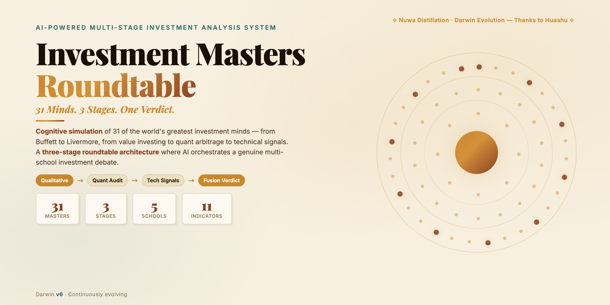
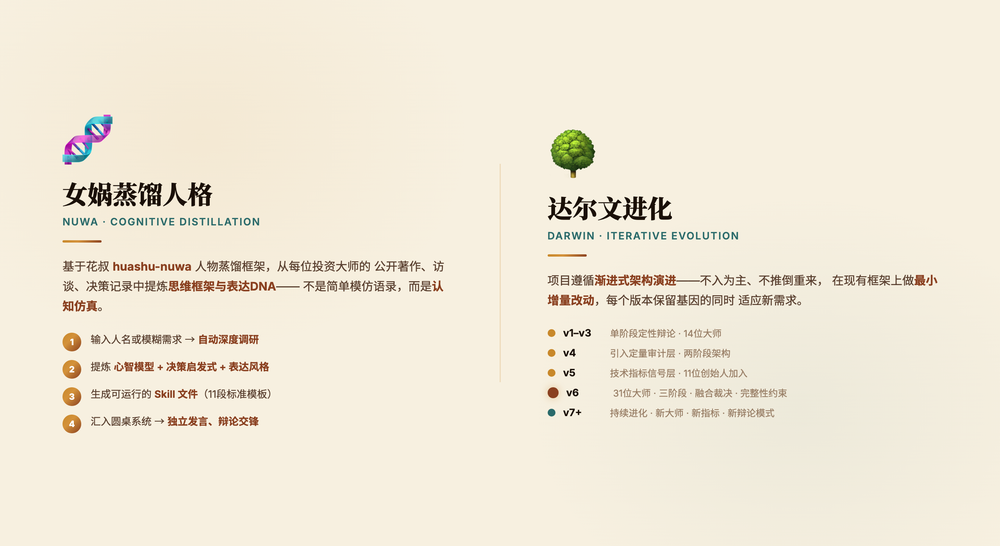

<div align="center">

<!-- Hero Banner -->


<br/>
<br/>

<h1>🏛️ Investment Masters Roundtable</h1>

<h3>37 AI-Powered Investment Masters • 3-Stage Debate System</h3>

<p><strong>14 Value Investors × 12 Technical Analysts × 11 Quantitative Signal Masters</strong></p>
<p>Three-stage analysis with real-time market data → Roundtable debate minutes + Technical charts + Investment recommendations</p>

<br/>

[](https://www.python.org/downloads/)
[](LICENSE)
[](https://platform.openai.com/)
[](https://github.com/ranaroussi/yfinance)
[](https://github.com/LucasYanzy/investment-masters-roundtable)

<br/>

[Quick Start](#-quick-start) · [Architecture](#-architecture) · [37 Masters](#-37-masters-across-3-stages) · [中文文档](README_CN.md)

</div>

<br/>

---

## ✨ What Makes This Special

> Imagine **Warren Buffett, George Soros, and 35 other legendary investors** sitting around a table, debating whether you should buy a stock — backed by real market data and powered by LLM reasoning.

| Feature | Description |
|---------|-------------|
| 🏛️ **Three-Stage Architecture** | Fundamental debate → Technical trend analysis → Quantitative signal voting |
| ⚔️ **Real Adversarial Debate** | Bull vs. Bear champions engage in multi-round LLM-driven debate — not just summaries |
| ⚠️ **Cross-Stage Conflict Detection** | Flags when fundamentals and technicals disagree: *"You are trading against Graham"* |
| 📊 **Signal Matrix Voting** | 11 quantitative masters independently generate signals → weighted vote → net direction |
| 📈 **One-Click Visualization** | Candlestick chart with MA/Bollinger/RSI/MACD overlays + support/resistance annotations |
| 🌐 **Multi-Market Support** | US stocks, Chinese A-shares, Hong Kong stocks — via `yfinance` + `akshare` |
| 🔌 **Any LLM Backend** | Works with GPT-4o, DeepSeek, Qwen, or any OpenAI-compatible API |

---

## 🧬 Design Philosophy: Nuwa Distillation × Darwin Evolution

<div align="center">

</div>

<br/>

---

## 🏗️ Architecture

```mermaid
flowchart TB
    subgraph INPUT["📥 Input"]
        USER["User: Stock Symbol + Market"]
    end

    subgraph DATA["⚙️ Data Engine"]
        direction LR
        OHLCV["OHLCV\nyfinance + akshare"]
        FUND["Fundamentals\nPE/PB/ROE/Revenue"]
        TECH["20+ Indicators\nMA/MACD/RSI/KDJ/BB/..."]
    end

    subgraph STAGE1["🏛️ Stage 1: Fundamental Debate (Weight: 60%)"]
        S1M["14 Investment Masters\nBuffett · Munger · Graham · Lynch\nMarks · Wood · Soros · Dalio\nDuan · Zhang · Li · Feng · Qiu · Lin"]
        S1P["7-Step Process\nIndependent → Camps → 2-Round Debate → Vote"]
    end

    subgraph STAGE2["📈 Stage 2: Technical Analysis (Weight: 20%)"]
        S2M["12 Technical Masters\nDow · Wyckoff · Elliott · Nison\nWilder · Appel · Granville · DeMark\nLane · Williams · Elder · ARBR"]
        S2P["Parallel Analysis\nTrend / Pattern / Volume-Price"]
    end

    subgraph STAGE3["⚡ Stage 3: Signal Voting (Weight: 20%)"]
        S3M["11 Signal Masters\nMACD · Bollinger · MA+OBV\nIchimoku · RSI/ADX · KDJ · CCI\nW%R · CMF · Triple Screen · Chaos"]
        S3P["Signal Matrix → Conflict Debate → Weighted Vote"]
    end

    subgraph OUTPUT["📊 Output"]
        MD["📝 Markdown Report"]
        HTML["🌐 HTML Report"]
        CHART["📈 Technical Chart"]
    end

    USER --> DATA
    DATA --> STAGE1
    STAGE1 -->|"consensus + dissent"| STAGE2
    STAGE2 -->|"trend confirmation"| STAGE3
    STAGE3 --> CROSS["⚠️ Cross-Stage\nConflict Detection"]
    CROSS --> AGG["🎯 60/20/20\nWeighted Aggregation"]
    AGG --> OUTPUT

    style INPUT fill:#1e293b,stroke:#3b82f6,color:#e2e8f0
    style DATA fill:#1e293b,stroke:#f97316,color:#e2e8f0
    style STAGE1 fill:#1e293b,stroke:#22c55e,color:#e2e8f0
    style STAGE2 fill:#1e293b,stroke:#eab308,color:#e2e8f0
    style STAGE3 fill:#1e293b,stroke:#ef4444,color:#e2e8f0
    style OUTPUT fill:#1e293b,stroke:#8b5cf6,color:#e2e8f0
```



---

## 🚀 Quick Start

```bash
# 1. Clone
git clone https://github.com/LucasYanzy/investment-masters-roundtable.git
cd investment-masters-roundtable

# 2. Install dependencies
pip install -r requirements.txt

# 3. Configure API key
cp .env.example .env
# Edit .env → set LLM_API_KEY (supports OpenAI / DeepSeek / Qwen)

# 4. Analyze any stock
python run.py --symbol AAPL --market US       # Apple (US)
python run.py --symbol 000001 --market CN     # Ping An Bank (China A-share)
python run.py --symbol 0700.HK --market HK    # Tencent (Hong Kong)

# 5. Launch Web UI
python run.py --web
```

### 📋 Output

Each analysis produces:
- `📝 {symbol}_report.md` — Full roundtable debate minutes
- `🌐 {symbol}_report.html` — Dark-themed interactive HTML report
- `📈 {symbol}_chart.png` — Candlestick + indicators chart

---

## 🤖 37 Masters Across 3 Stages

<details>
<summary><b>🏛️ Stage 1: 14 Investment Masters (Qualitative Debate)</b></summary>

| # | Master | School | Core Framework |
|---|--------|--------|----------------|
| 1 | Warren Buffett | Value Investing | Moat, margin of safety, long-term holding |
| 2 | Charlie Munger | Value Investing | Mental models, inversion thinking |
| 3 | Benjamin Graham | Value Investing | Intrinsic value, Mr. Market, safety margin |
| 4 | Peter Lynch | Growth Investing | PEG valuation, invest in what you know |
| 5 | Howard Marks | Contrarian | Second-level thinking, cycle positioning |
| 6 | Cathie Wood | Disruptive Innovation | ARK innovation framework |
| 7 | George Soros | Macro Hedge | Reflexivity theory, trend trading |
| 8 | Ray Dalio | Macro Hedge | Economic machine, debt cycles, All Weather |
| 9 | Duan Yongping 段永平 | Pragmatist | Business model first, "ben fen" philosophy |
| 10 | Zhang Lei 张磊 | Growth Investing | Structural value, dynamic moats |
| 11 | Li Lu 李录 | Value Investing | Circle of competence, Civilization 3.0 |
| 12 | Feng Liu 冯柳 | Contrarian | Weak-form system, odds thinking |
| 13 | Qiu Guolu 邱国鹭 | Value Investing | "Count moons, not stars" |
| 14 | Lin Yuan 林园 | Consumer Investing | Monopoly brands, "mouth stocks" |

</details>

<details>
<summary><b>📈 Stage 2: 12 Technical Analysis Masters (Trend / Pattern / Volume)</b></summary>

| # | Master | Core Theory | Focus Area |
|---|--------|-------------|------------|
| 1 | Charles Dow | Dow Theory | Primary / secondary / minor trends |
| 2 | Richard Wyckoff | Wyckoff Method | Volume-price, accumulation/distribution |
| 3 | Ralph Elliott | Wave Theory | Wave counting, Fibonacci |
| 4 | Steve Nison | Japanese Candlesticks | Candlestick pattern recognition |
| 5 | J. Welles Wilder | RSI/DMI/ADX/ATR | Trend strength, volatility |
| 6 | Gerald Appel | MACD | Moving average convergence divergence |
| 7 | Joseph Granville | Volume 8 Rules | OBV volume-price validation |
| 8 | Thomas DeMark | TD Sequential | Precise buy/sell points |
| 9 | George Lane | Stochastic/KDJ | Overbought/oversold zones |
| 10 | Larry Williams | Williams %R | Extreme price levels |
| 11 | Alexander Elder | Triple Screen | Multi-timeframe analysis |
| 12 | ARBR Team | Sentiment Indicators | Market sentiment gauges |

</details>

<details>
<summary><b>⚡ Stage 3: 11 Quantitative Signal Masters (Pure Numerical Signals + Debate)</b></summary>

| # | Master | Indicators | Signal Output |
|---|--------|-----------|---------------|
| 1 | Gerald Appel | MACD | Golden/death cross + target levels |
| 2 | John Bollinger | Bollinger Bands | Band breakout/reversion |
| 3 | Joseph Granville | MA + OBV | Moving average cross + volume validation |
| 4 | Goichi Hosoda | Ichimoku Cloud | Cloud support/resistance |
| 5 | J. Welles Wilder | RSI/ADX/ATR/PSAR | Overbought/oversold + trend strength |
| 6 | George Lane | KDJ | %K/%D crossover |
| 7 | Donald Lambert | CCI | Channel breakout |
| 8 | Larry Williams | W%R | Overbought/oversold / divergence |
| 9 | Marc Chaikin | CMF | Money flow direction |
| 10 | Alexander Elder | Triple Screen | Multi-timeframe signals |
| 11 | Bill Williams | Chaos Trading | Alligator/Fractal/AO/AC |

</details>

---

## 📁 Project Structure

```
investment-masters-roundtable/
├── run.py                        # CLI entry + Web launcher
├── config.py                     # Global config (env-driven)
│
├── data_engine/                  # Data layer
│   ├── fetcher.py                #   OHLCV (yfinance + akshare)
│   ├── fundamental_data.py       #   Fundamentals (valuation/financials)
│   ├── technical_indicators.py   #   20+ technical indicators
│   ├── cache.py                  #   2-level cache (LRU + file)
│   └── schema.py                 #   Unified data structures
│
├── masters/                      # 37 masters analysis layer
│   ├── base_master.py            #   Base class + LLM call + MasterOpinion
│   ├── registry.py               #   37-master registry
│   ├── investment_master.py      #   Stage 1: 14 investment masters
│   ├── technical_master.py       #   Stage 2: 12 technical masters
│   ├── signal_master.py          #   Stage 3: 11 signal masters
│   └── skill_references/         #   Master frameworks (.md)
│       ├── investment_masters/   #     14 value/growth frameworks
│       ├── technical_masters/    #     12 technical analysis frameworks
│       └── signal_masters/       #     11 quantitative signal frameworks
│
├── debate_orchestrator/          # Debate coordination layer
│   ├── orchestrator.py           #   Main orchestrator (3-stage)
│   ├── stage1_debate.py          #   Stage 1: 7-step debate
│   ├── stage2_analysis.py        #   Stage 2: parallel analysis
│   ├── stage3_signals.py         #   Stage 3: signal matrix + debate
│   ├── cross_stage_conflict.py   #   Cross-stage conflict detection
│   └── aggregator.py             #   60/20/20 weighted aggregation
│
├── report_generator/             # Report generation layer
│   ├── markdown_report.py        #   Markdown roundtable minutes
│   ├── html_report.py            #   Dark-themed HTML report
│   └── chart_renderer.py         #   mplfinance technical charts
│
├── web_app/                      # Web interface (Flask)
│   ├── app.py                    #   Flask application
│   └── templates/index.html      #   Dark-themed SPA
│
├── tests/                        # Tests
│   └── test_smoke.py             #   Smoke tests
│
├── docs/                         # Documentation
│   └── architecture.md           #   System architecture
│
└── examples/                     # Sample outputs
```

---

## 🔧 Tech Stack

| Layer | Technology |
|-------|-----------|
| **Data Fetching** | `yfinance` (US/HK) + `akshare` (China A-shares) |
| **Technical Indicators** | `pandas-ta` + pure pandas/numpy fallback |
| **LLM Integration** | OpenAI-compatible API (GPT-4o / DeepSeek / Qwen) |
| **Concurrency** | `asyncio` (parallel within stage, serial between stages) |
| **Visualization** | `mplfinance` + `matplotlib` |
| **Web Interface** | Flask + dark-themed SPA |
| **Logging** | Python `logging` with `--verbose` mode |

---

## ⚙️ Configuration

Copy `.env.example` → `.env`:

```ini
# LLM (any OpenAI-compatible API)
LLM_API_BASE=https://api.openai.com/v1
LLM_API_KEY=sk-xxx
LLM_MODEL=gpt-4o

# Data
DEFAULT_PERIOD=2y          # Historical data length
FMP_API_KEY=               # Optional: financialmodelingprep

# Stage Weights (must sum to 1.0)
STAGE1_WEIGHT=0.6          # Fundamentals
STAGE2_WEIGHT=0.2          # Technical confirmation
STAGE3_WEIGHT=0.2          # Signal timing
```

---

## 📈 Performance

| Metric | Value |
|--------|-------|
| **LLM Calls** | 37 base + up to 6 debate rounds ≈ ~43 calls |
| **Analysis Time** | 30–120 seconds (depends on LLM response speed) |
| **Concurrency** | All masters parallel within each stage (14 / 12 / 11) |
| **Cache TTL** | Technical data: 1h, Fundamentals: 24h |

---

## 🤝 Contributing

We welcome contributions! Please see [CONTRIBUTING.md](CONTRIBUTING.md) for guidelines.

1. Fork the repository
2. Create your feature branch (`git checkout -b feature/amazing-feature`)
3. Commit your changes (`git commit -m 'feat: add amazing feature'`)
4. Push to the branch (`git push origin feature/amazing-feature`)
5. Open a Pull Request

---

## 📄 License

[MIT](LICENSE) © 2026 Lucas Yan

---

<div align="center">

**⭐ If this project helps you, please give it a Star!**

**[中文文档 →](README_CN.md)**

</div>