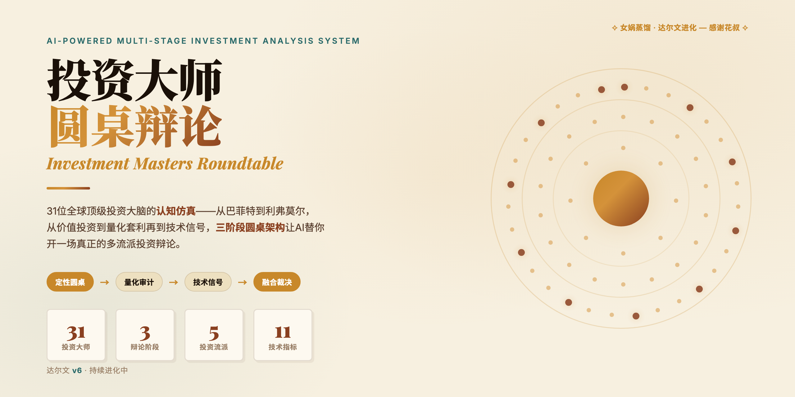

<div align="center">

<!-- Hero Banner -->


<br/>
<br/>

<h1>🏛️ 投资大师圆桌辩论系统</h1>

<h3>37 位 AI 驱动的投资大师 · 三阶段辩论架构</h3>

<p><strong>14 位价值投资大师 × 12 位技术分析大师 × 11 位量化信号大师</strong></p>
<p>三阶段分析你的股票 — 产出圆桌辩论纪要 + 技术图表 + 综合投资建议</p>

<br/>

[](https://www.python.org/downloads/)
[](LICENSE)
[](https://platform.openai.com/)
[](https://github.com/ranaroussi/yfinance)

<br/>

[快速开始](#-快速开始) · [系统架构](#-系统架构) · [37位大师](#-37位大师三阶段) · [English Docs](README.md)

</div>

<br/>

---

## ✨ 核心亮点

> 想象一下 **巴菲特、索罗斯、格雷厄姆**和其他 34 位传奇投资大师围坐一桌，基于真实市场数据，用各自的投资体系辩论你该不该买一只股票。

| 特性 | 说明 |
|------|------|
| 🏛️ **三阶段分析架构** | 基本面定性辩论 → 技术趋势判断 → 量化信号投票，层层递进 |
| ⚔️ **真实辩论交锋** | 多空阵营代表进行 2 轮 LLM 驱动的对抗辩论，不是简单汇总 |
| ⚠️ **跨阶段冲突检测** | 基本面 vs 技术面矛盾时独立标注：*"You are trading against Graham"* |
| 📊 **信号矩阵投票** | 11 位指标大师独立出信号 → 加权投票 → 净方向得分 |
| 📈 **一键可视化** | K 线图叠加均线/布林/RSI/MACD + 支撑阻力标注 |
| 🌐 **多市场支持** | 美股 / A 股 / 港股，yfinance + akshare 双源覆盖 |
| 🔌 **任意 LLM 后端** | GPT-4o、DeepSeek、Qwen 或任何 OpenAI 兼容 API |

---

## 🧬 设计哲学：女娲蒸馏 × 达尔文进化

<div align="center">

</div>

<br/>

---

## 🏗️ 系统架构

```mermaid
flowchart TB
    subgraph INPUT["📥 用户输入"]
        USER["股票代码 + 市场"]
    end

    subgraph DATA["⚙️ 数据引擎"]
        direction LR
        OHLCV["OHLCV 行情\nyfinance + akshare"]
        FUND["基本面数据\nPE/PB/ROE/营收"]
        TECH["20+ 技术指标\nMA/MACD/RSI/KDJ/BB/..."]
    end

    subgraph STAGE1["🏛️ 阶段一：基本面辩论（权重 60%）"]
        S1M["14 位投资大师\n巴菲特 · 芒格 · 格雷厄姆 · 林奇\n马克斯 · 伍德 · 索罗斯 · 达利欧\n段永平 · 张磊 · 李录 · 冯柳 · 邱国鹭 · 林园"]
        S1P["七步流程\n独立估值 → 阵营划分 → 2轮辩论 → 投票"]
    end

    subgraph STAGE2["📈 阶段二：技术分析（权重 20%）"]
        S2M["12 位技术大师\n道 · 威科夫 · 艾略特 · 尼森\n威尔德 · 阿佩尔 · 葛兰碧 · 德马克\n莱恩 · 威廉姆斯 · 埃尔德 · ARBR"]
        S2P["并行分析\n趋势 / 形态 / 量价"]
    end

    subgraph STAGE3["⚡ 阶段三：信号投票（权重 20%）"]
        S3M["11 位信号大师\nMACD · 布林 · MA+OBV\n一目均衡 · RSI/ADX · KDJ · CCI\nW%R · CMF · 三重滤网 · 混沌"]
        S3P["信号矩阵 → 冲突辩论 → 加权投票"]
    end

    subgraph OUTPUT["📊 报告输出"]
        MD["📝 Markdown 圆桌纪要"]
        HTML["🌐 HTML 可视化报告"]
        CHART["📈 技术图表"]
    end

    USER --> DATA
    DATA --> STAGE1
    STAGE1 -->|"共识 + 分歧"| STAGE2
    STAGE2 -->|"趋势确认"| STAGE3
    STAGE3 --> CROSS["⚠️ 跨阶段\n冲突检测"]
    CROSS --> AGG["🎯 60/20/20\n加权聚合"]
    AGG --> OUTPUT

    style INPUT fill:#1e293b,stroke:#3b82f6,color:#e2e8f0
    style DATA fill:#1e293b,stroke:#f97316,color:#e2e8f0
    style STAGE1 fill:#1e293b,stroke:#22c55e,color:#e2e8f0
    style STAGE2 fill:#1e293b,stroke:#eab308,color:#e2e8f0
    style STAGE3 fill:#1e293b,stroke:#ef4444,color:#e2e8f0
    style OUTPUT fill:#1e293b,stroke:#8b5cf6,color:#e2e8f0
```



---

## 🚀 快速开始

```bash
# 1. 克隆
git clone https://github.com/LucasYanzy/investment-masters-roundtable.git
cd investment-masters-roundtable

# 2. 安装依赖
pip install -r requirements.txt

# 3. 配置 API 密钥
cp .env.example .env
# 编辑 .env，填入 LLM_API_KEY（支持 OpenAI / DeepSeek / Qwen）

# 4. 运行分析
python run.py --symbol AAPL --market US       # 美股苹果
python run.py --symbol 000001 --market CN     # A股平安银行
python run.py --symbol 0700.HK --market HK    # 港股腾讯

# 5. 启动 Web 界面
python run.py --web
```

### 📋 分析输出

每次分析会生成：
- `📝 {symbol}_report.md` — 完整圆桌辩论纪要
- `🌐 {symbol}_report.html` — 暗色主题 HTML 可视化报告
- `📈 {symbol}_chart.png` — K 线 + 指标图表

---

## 🤖 37位大师（三阶段）

<details>
<summary><b>🏛️ 阶段一：14 位投资大师（定性辩论）</b></summary>

| # | 大师 | 学派 | 核心框架 |
|---|------|------|----------|
| 1 | 沃伦·巴菲特 | 价值投资 | 护城河、安全边际、长期持有 |
| 2 | 查理·芒格 | 价值投资 | 多元思维模型、逆向思维 |
| 3 | 本杰明·格雷厄姆 | 价值投资 | 内在价值、市场先生、安全边际 |
| 4 | 彼得·林奇 | 成长投资 | PEG 估值、生活中的投资机会 |
| 5 | 霍华德·马克斯 | 逆向投资 | 第二层思维、周期定位 |
| 6 | 凯瑟琳·伍德 | 颠覆创新 | ARK 颠覆性创新框架 |
| 7 | 乔治·索罗斯 | 宏观对冲 | 反身性理论、趋势交易 |
| 8 | 瑞·达利欧 | 宏观对冲 | 经济机器、债务周期、全天候 |
| 9 | 段永平 | 实用主义 | 本分、商业模式优先 |
| 10 | 张磊 | 成长投资 | 长期结构性价值、动态护城河 |
| 11 | 李录 | 价值投资 | 能力圈、文明 3.0 现代化 |
| 12 | 冯柳 | 逆向投资 | 弱者体系、赔率思维 |
| 13 | 邱国鹭 | 价值投资 | 数月亮不数星星 |
| 14 | 林园 | 消费投资 | 嘴巴股、垄断品牌 |

</details>

<details>
<summary><b>📈 阶段二：12 位技术分析大师（趋势 / 形态 / 量价）</b></summary>

| # | 大师 | 核心理论 | 分析重点 |
|---|------|----------|----------|
| 1 | 查尔斯·道 | 道氏理论 | 主要/次要/短期趋势 |
| 2 | 理查德·威科夫 | 威科夫方法 | 量价关系、吸筹/派发 |
| 3 | 拉尔夫·艾略特 | 波浪理论 | 波浪计数、斐波那契 |
| 4 | 史蒂夫·尼森 | 日本蜡烛图 | K 线形态识别 |
| 5 | 威尔德 | RSI/DMI/ADX/ATR | 趋势强度、波动率 |
| 6 | 杰拉尔德·阿佩尔 | MACD | 移动平均收敛发散 |
| 7 | 约瑟夫·葛兰碧 | 量价八法则 | OBV 量价验证 |
| 8 | 托马斯·德马克 | TD 序列 | 精确买卖点 |
| 9 | 乔治·莱恩 | 随机指标 | KDJ 超买超卖 |
| 10 | 拉里·威廉姆斯 | W%R | 极端价位判断 |
| 11 | 亚历山大·埃尔德 | 三重滤网 | 多时间框架分析 |
| 12 | ARBR 团队 | 情绪指标 | 人气意愿、市场情绪 |

</details>

<details>
<summary><b>⚡ 阶段三：11 位量化信号大师（纯数字信号 + 辩论投票）</b></summary>

| # | 大师 | 覆盖指标 | 输出信号 |
|---|------|----------|----------|
| 1 | Gerald Appel | MACD | 金叉/死叉 + 目标位 |
| 2 | John Bollinger | 布林带 | 上下轨突破/回归 |
| 3 | Joseph Granville | MA + OBV | 均线交叉 + 量价验证 |
| 4 | Goichi Hosoda | 一目均衡表 | 云层支撑/阻力 |
| 5 | J. Welles Wilder | RSI/ADX/ATR/PSAR | 超买超卖 + 趋势强度 |
| 6 | George Lane | KDJ | %K/%D 交叉 |
| 7 | Donald Lambert | CCI | 通道突破 |
| 8 | Larry Williams | W%R | 超买超卖/背离 |
| 9 | Marc Chaikin | CMF | 资金流入流出 |
| 10 | Alexander Elder | 三重滤网 | 多时间框架信号 |
| 11 | Bill Williams | 混沌操作法 | 鳄鱼线/分形/AO/AC |

</details>

---

## 🔧 技术栈

| 层 | 技术 |
|---|------|
| **数据获取** | `yfinance`（美股/港股）+ `akshare`（A 股） |
| **技术指标** | `pandas-ta` + 纯 pandas/numpy 降级方案 |
| **LLM 集成** | OpenAI 兼容 API（GPT-4o / DeepSeek / Qwen） |
| **并发控制** | `asyncio`（阶段内并行，阶段间串行） |
| **可视化** | `mplfinance` + `matplotlib` |
| **Web 界面** | Flask + 暗色主题单页应用 |

---

## ⚙️ 配置说明

复制 `.env.example` → `.env`：

```ini
# LLM（支持任何 OpenAI 兼容 API）
LLM_API_BASE=https://api.openai.com/v1
LLM_API_KEY=sk-xxx
LLM_MODEL=gpt-4o

# 数据
DEFAULT_PERIOD=2y          # 拉取历史长度
FMP_API_KEY=               # 可选: financialmodelingprep

# 阶段权重（总和 = 1.0）
STAGE1_WEIGHT=0.6          # 基本面
STAGE2_WEIGHT=0.2          # 趋势确认
STAGE3_WEIGHT=0.2          # 信号时机
```

---

## 📈 性能

| 指标 | 数值 |
|------|------|
| **LLM 调用** | 37 次基础 + 最多 6 次辩论 = ~43 次 |
| **分析时间** | 30–120 秒（取决于 LLM 响应速度） |
| **并发** | 阶段内全部大师并行（14 / 12 / 11 并发） |
| **缓存 TTL** | 技术数据 1h，基本面 24h |

---

## 🤝 贡献

欢迎 Issue 和 PR！请查看 [CONTRIBUTING.md](CONTRIBUTING.md) 了解详细指南。

1. Fork 本仓库
2. 创建功能分支 (`git checkout -b feature/amazing-feature`)
3. 提交更改 (`git commit -m 'feat: add amazing feature'`)
4. 推送 (`git push origin feature/amazing-feature`)
5. 提交 Pull Request

---

## 📄 License

[MIT](LICENSE) © 2026 Lucas Yan

---

<div align="center">

**⭐ 如果这个项目对你有帮助，请 Star 支持！**

**[English Docs →](README.md)**

</div>
