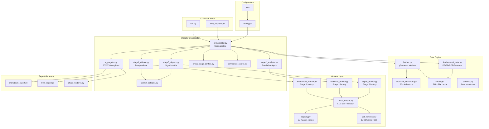

# System Architecture

## Overview

Investment Masters Roundtable is a multi-agent AI debate system that uses 37 specialized LLM-powered "masters" to analyze stocks across three complementary dimensions: fundamental value, technical trends, and quantitative signals.

## Architecture Diagram



## Data Flow

### Stage Pipeline (Serial)

```
Stage 1 (60% weight)        Stage 2 (20% weight)        Stage 3 (20% weight)
┌──────────────────┐        ┌──────────────────┐        ┌──────────────────┐
│ 14 Investment     │        │ 12 Technical      │        │ 11 Signal        │
│ Masters           │ ────→ │ Masters           │ ────→ │ Masters          │
│                   │        │                   │        │                  │
│ Input: Fundament- │        │ Input: OHLCV +    │        │ Input: OHLCV +   │
│ als (PE/PB/ROE)   │        │ Tech Indicators   │        │ Indicator Values │
│                   │        │                   │        │                  │
│ Process:          │        │ Process:          │        │ Process:         │
│ 1. Independent    │        │ 1. Parallel       │        │ 1. Parallel      │
│    analysis       │        │    analysis       │        │    signal gen    │
│ 2. Camp division  │        │ 2. Consensus      │        │ 2. Conflict      │
│ 3. 2-round debate │        │    trend          │        │    detection     │
│ 4. Vote           │        │ 3. Key levels     │        │ 3. Debate        │
│                   │        │                   │        │ 4. Weighted vote │
│ Output:           │        │ Output:           │        │ Output:          │
│ Bull/Bear/Neutral │        │ Trend + S/R       │        │ Signal matrix +  │
│ + Debate record   │        │ levels            │        │ Net direction    │
└──────────────────┘        └──────────────────┘        └──────────────────┘
                                                                 │
                                                                 ▼
                                                    ┌──────────────────┐
                                                    │ Cross-Stage      │
                                                    │ Conflict Check   │
                                                    │ + 60/20/20 Agg   │
                                                    └──────────────────┘
```

### LLM Call Pattern

Each master's `analyze()` method:
1. Loads its skill framework from `skill_references/*.md`
2. Combines framework + market data into a prompt
3. Calls LLM with `response_format=json_object`
4. Parses response into `MasterOpinion` dataclass
5. Falls back to neutral opinion on any error

**Concurrency**: All masters within a stage run in parallel via `asyncio.gather()`. Stages execute serially.

## Extension Points

### Adding a New Master

1. Add entry to `masters/registry.py`
2. Create `masters/skill_references/{stage}/{name}-perspective.md`
3. Update count in `config.py`
4. The factory functions automatically pick up new registry entries

### Adding a New Market

1. Add market handler in `data_engine/fetcher.py`
2. Add fundamental data source in `data_engine/fundamental_data.py`
3. Add market option to CLI in `run.py`

### Custom LLM Backend

Set in `.env`:
```ini
LLM_API_BASE=https://your-api-endpoint.com/v1
LLM_API_KEY=your-key
LLM_MODEL=your-model-name
```

Any OpenAI-compatible API works out of the box.
